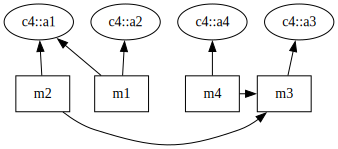

# LCOM Metric Analyzer

## Description

LCOM Metric Analyzer is a tool that evaluates the quality of object-oriented code by identifying classes that lack cohesion.
These classes can be broken down into smaller, more manageable units for improved clarity and maintenance.
Cohesion is measured using the various LCOM (Lack of Cohesion of Methods) metrics, and source code is processed using the [ROSE compiler infrastructure](http://rosecompiler.org/).

## Example

Given the following source code for the class in [`c4.adb`](testcases/simple-cases/c4.adb):

```ada
package body c4 is
    procedure m1 is
    begin
        a1 := 1;
        a2 := 2;
    end m1;
    procedure m2 is
    begin
        a1 := 1;
        m3;
    end m2;
    procedure m3 is
    begin
        a3 := 3;
    end m3;
    procedure m4 is
    begin
        a4 := 4;
        m3;
    end m4;
end c4;
```

Our tool converts it into an LCOM graph, where each method is a box, each attribute is an ellipse, and arrows indicate an attribute/method access.
Note how methods can call other methods, with arrows between boxes indicating the calls.



This graph is analyzed by the tool using the [definitions of LCOM](#lcom-definitions-in-plain-english) to compute the lack of cohesion of methods for the class.

| LCOM1 | LCOM2 | LCOM3 | LCOM4 | LCOM5 |
|-------|-------|-------|-------|-------|
| 5     | 4     | 3     | 1     | 11/12 |

## Installing

This tool has been tested to work with **Ubuntu 20.04** and **Ubuntu 22.04**, but in principle, any Linux distribution supported by ROSE should work.

For ease of use, a `dockerfile` has been provided. It can be built using the following command:
```bash
docker build -t lcom -f dockerfile .
```

Manual installation instructions follow:

### Dependencies
Install the required dependencies using your package manager:
```bash
sudo apt-get update
sudo apt-get install -y bison byacc cmake dbus flex fontconfig g++ git gnat gprbuild libtool libx11-xcb1 make python3 wget
```

### Example environment
Set up the environment by choosing where to install tools.
Add these to your `.bashrc`.

```bash
# Set these to an install location of your preference for each tool.
export GNAT_HOME="/GNAT/2019"
# Set these based on where you place the associated git repositories.
export BOOST_REPO="/boost_1_83_0"
export ROSE_REPO="/rose"
export GTEST_REPO="/gtest-parallel"
export LCOM_HOME="/ROSE-LCOM-Tools"

# These paths make it possible for all tools to be found during the build and run process.
# They should generally remain unchanged.
export PATH="$GNAT_HOME/bin:$PATH"
# export LD_LIBRARY_PATH="$GNAT_HOME/lib64:$GNAT_HOME/lib:$LD_LIBRARY_PATH"
export BOOST_HOME="$BOOST_REPO/install"
export LD_LIBRARY_PATH="$BOOST_HOME/stage/lib":$LD_LIBRARY_PATH
export BOOST_LIB="$BOOST_HOME/stage/libexport"
export ROSE_HOME="$ROSE_REPO/install_tree"
export BOOST_ROOT="$BOOST_HOME"
export ASIS_ADAPTER="$ROSE_REPO/build_tree/src/frontend/Experimental_Ada_ROSE_Connection/parser/asis_adapter"
```

### Installing GNAT Community Edition 2019:
To install [GNAT](https://blog.adacore.com/gnat-community-2019-is-here), you can one of two methods: (1) an automated install using a community-created tool or (2) manually via a GUI.
#### Automated install
```bash
git clone --depth 1 https://github.com/AdaCore/gnat_community_install_script.git
pushd gnat_community_install_script
wget -O gnat-community-2019-20190517-x86_64-linux-bin https://community.download.adacore.com/v1/0cd3e2a668332613b522d9612ffa27ef3eb0815b?filename=gnat-community-2019-20190517-x86_64-linux-bin
sh install_package.sh ./gnat-community-2019-20190517-x86_64-linux-bin $GNAT_HOME
popd
```
*or*
#### Manual install
```bash
wget -O gnat-community-2019-20190517-x86_64-linux-bin https://community.download.adacore.com/v1/0cd3e2a668332613b522d9612ffa27ef3eb0815b?filename=gnat-community-2019-20190517-x86_64-linux-bin
chmod +x gnat-community-2019-20190517-x86_64-linux-bin 
./gnat-community-2019-20190517-x86_64-linux-bin
# Follow the setup instructions, installing to the location specified by $GNAT_HOME.
```

### Building ASIS
```bash
wget -O asis.tar.gz https://community.download.adacore.com/v1/52c69e7295dc301ce670334f8150193ecbec580d?filename=asis-2019-20190517-18AB5-src.tar.gz
tar -xvzf asis.tar.gz
pushd asis-2019-20190517-18AB5-src
sed -i 's/for Library_Kind use \"static\";/for Library_Kind use \"dynamic\";/g' asis.gpr
make all install prefix=$GNAT_HOME
popd
rm asis.tar.gz
```

### Building BOOST
Build and install [BOOST](https://www.boost.org/) using the GNAT compiler.
```bash
wget https://boostorg.jfrog.io/artifactory/main/release/1.83.0/source/boost_1_83_0.tar.bz2
tar -xvf boost_1_83_0.tar.bz2
pushd $BOOST_REPO
mkdir -p tools/build/src/
echo "using gcc : 8.3.1 : $GNAT_HOME/bin/g++ ; " >> tools/build/src/user-config.jam
bash bootstrap.sh
./b2 -j$(nproc)
./b2 install --prefix=$BOOST_HOME
popd
rm boost_1_83_0.tar.bz2
```

### Building ROSE
Build [ROSE](https://github.com/rose-compiler/rose) with Ada language support with the following commands.

**NOTE**: The Ada representation in ROSE is not yet finalized, so incompatibilities with newer versions of ROSE may be possible. Our tool is confirmed to work with ROSE version `0.11.145.3`.

```bash
mkdir -p $ROSE_REPO
git -C $ROSE_REPO --depth 1 https://github.com/rose-compiler/rose.git .
cd $ROSE_REPO
./build
mkdir -p build_tree
pushd build_tree
export LD_LIBRARY_PATH="$GNAT_HOME/lib64:$GNAT_HOME/lib:$LD_LIBRARY_PATH"
../configure --prefix=$ROSE_HOME --enable-languages=c,c++ --enable-experimental_ada_frontend --without-swi-prolog --without-cuda --without-java --without-python --with-boost=$BOOST_HOME --verbose --with-DEBUG=-ggdb --with-alloc-memset=2 --with-OPTIMIZE="-O0 -march=native -p -DBOOST_TIMER_ENABLE_DEPRECATED" --with-WARNINGS="-Wall -Wextra -Wno-misleading-indentation -Wno-unused-parameter" CXX=$GNAT_HOME/bin/g++ CC=$GNAT_HOME/bin/gcc
make core -j$(nproc)
make install-core -j$(nproc)
make check-core -j$(nproc)
# Build the ROSE AST DOT graph generator.
pushd exampleTranslators
make -j$(nproc)
popd
popd
# NOTE: You may need to restart your terminal after this to clear the changes to LD_LIBRARY_PATH. Adding GNAT to the path adds out-of-date libraries as well, and may throw errors when running certain commands. However, it is required for the build process.
```

### Setting up Google Tests Parallel Script
This is used by [`allTest.py`](script/allTest.py) to run all test cases in parallel.

```bash
mkdir -p $GTEST_REPO
git -C $GTEST_REPO --depth 1 https://github.com/google/gtest-parallel.git .
```

## Building and testing the tool

The recommended process uses [`cmake`](CMakeLists.txt). A [`Makefile`](Makefile) is also provided.

Start by cloning the repo such that it is in the location specified by `$LCOM_HOME`
```bash
mkdir -p $LCOM_HOME
git -C $LCOM_HOME --depth 1 https://github.com/LLNL/ROSE-LCOM-Tools.git .
cd $LCOM_HOME
```

Now choose a build process, either using `cmake` or running the full build command.

### cmake

```bash
rm -r build/; # Remove the build directory to ensure a fresh build (rarely needed)
cmake -S . -B build # Create the build directory with autogenerated makefiles
cmake --build build --parallel $(nproc) # Build all LCOM tools in parallel
pushd build && ctest; popd # Run GTests sequentially

# Alternatively run GTests in parallel
$GTEST_REPO/gtest-parallel build/lcom-unittest
```

### Full build command

As an alternative to a proper build system, you can also build directly with the following commands:

```bash
mkdir -p build
# Main LCOM tool.
g++ -o build/lcom.out src/lcom.cpp -Iinclude -I${ROSE_HOME}/include/rose -I${BOOST_HOME}/include -lrose -lboost_date_time -lboost_thread -lboost_filesystem -lboost_program_options -lboost_regex -lboost_system -lboost_serialization -lboost_wave -lboost_iostreams -lboost_chrono -ldl -lm -lquadmath -lasis_adapter -lstdc++fs -pthread -L${ROSE_HOME}/lib -L${BOOST_HOME}/lib -L${ASIS_ADAPTER}/lib -Wl,-rpath ${BOOST_HOME}/lib -Wl,-rpath ${ASIS_ADAPTER}/lib -Wl,-rpath=${ROSE_HOME}/lib
# LCOM DOT graph generator for visualizations.
g++ -o build/lcom-dot.out src/lcom-dot.cpp -Iinclude -I${ROSE_HOME}/include/rose -I${BOOST_HOME}/include -lrose -lboost_date_time -lboost_thread -lboost_filesystem -lboost_program_options -lboost_regex -lboost_system -lboost_serialization -lboost_wave -lboost_iostreams -lboost_chrono -ldl -lm -lquadmath -lasis_adapter -lstdc++fs -pthread -L${ROSE_HOME}/lib -L${BOOST_HOME}/lib -L${ASIS_ADAPTER}/lib -Wl,-rpath ${BOOST_HOME}/lib -Wl,-rpath ${ASIS_ADAPTER}/lib -Wl,-rpath=${ROSE_HOME}/lib
```

### Optional tests

This tool has been tested with additional sources not included in this repo.
You can prepare them for use with this tool using the following commands:

```bash
bash acats.sh &
bash osc.sh
```

#### ACATS

ROSE is designed to support Ada 95, so we use the associated ACATS version, 2.6.
[`acats.sh`](acats.sh) can be used to download and process the source into `testcases/acats`.

#### Open-source code

A collection of open source code that uses the Ada 95 language.

| Project                                                                               | Ada lines of code |
|---------------------------------------------------------------------------------------|------------------:|
| [Ada Exploiting](https://github.com/bkungl/AdaExploiting)                             | 1,675             |
| [Ada Structured Library](https://sourceforge.net/projects/adasl/)                     | 48,258            |
| [ALIRE: Ada LIbrary REpository](https://github.com/alire-project/alire)               | 50,999            |
| [Ada 95 Booch Components](https://sourceforge.net/projects/booch95/)                  | 34,073            |
| [Simple components for Ada](https://sourceforge.net/projects/simplecomponentsforada/) | 463,660           |
| [Fuzzy sets for Ada](https://sourceforge.net/projects/fuzzysetsforada/)               | 695,430           |
| [GNAT Studio](https://github.com/AdaCore/gnatstudio)                                  | 845,908           |
| [Libadalang-tools](https://github.com/AdaCore/libadalang-tools)                       | 140,481           |
| [LinXtris](https://sourceforge.net/projects/linxtris/)                                | 5,341             |
| [PHCpack](https://github.com/janverschelde/PHCpack)                                   | 2,492,729         |
| [PNG_IO](https://sourceforge.net/projects/png-io/)                                    | 4,214             |
| [SHA-1](https://github.com/UlrikHjort/SHA-1)                                          | 498               |
| [Ada KALINDA OS](https://sourceforge.net/projects/sx-ada-kalinda/)                    | 20,383            |

To download the source into `testcases/osc`, run [`osc.sh`](osc.sh)
This will download all of the projects in parallel.

#### simple-cpp-programs

Some basic C++ programs.
These were used to verify functionality of the LCOM tool on basic C++ code.
More accurate, comprehensive C++ support is a work in progress.

```bash
git clone https://github.com/amngupta/simple-cpp-programs.git testcases/simple-cpp-programs
```

## Usage

### Quick start

Run `bash allTest.sh` to run tests.

### Custom run

1. Copy any source code into `testcases/<your directory here>` for evaluation.
1. Many options can be specified. View them with `python3 scripts/allTest.py -h`
1. Run `python3 scripts/allTest.py <task>`, specifying which tasks you want to run. The following tasks are available:
- build
- wipe_output
- make_dot_graphs
- gen_lcom
- make_lcom_dot_graphs
- combine_csv
- run_gtests **NOTE**: Will not work without cmake.

Multiple tasks, each separated by a space, can be selected to run in one test.
If no task is specified, all of them will run.

## High-level code overview

### [AST Traversal](include/traverse.hpp)

Abstract syntax tree traversal is the most complex step.
At a high level, it works using ROSE's AstTopDownProcessing visitor traversal pattern, a recursive pattern that accesses each node from the top down.
This ensures every node is evaluated.
An inherited attribute is copied down to child nodes, but all inherited attributes are static in our approach.
Whenever one of our target node types is seen (e.g., Class=`SgAdaPackageSpec*`, Method=`SgFunctionDeclaration*`, Attribute=`SgInitializedName*`), we process its relationship with the other nodes.

#### Class

The class is the simplest.
When a class node is seen, it is added to the list of classes.

#### Method

When a method is seen, it is added to the list of methods and associated to its parent class.
The parent class is identified by traversing up to parent scopes until a matching class type is seen.

#### Attribute

When an attribute is seen, it is added to the list of attributes and associated to its parent method.
The parent method is identified by traversing up to parent scopes until a matching method type is seen.

#### Called method

When a method is called, it is associated to the method that called it by traversing up to parent scopes until a matching method type is seen.

#### Ada renamings

Attributes and methods can be renamed in Ada, complicating the process of identifying methods that share attributes.
When a renaming, pointer, etc. is seen, it is stored in a renaming map, which can be used to look up the root attribute or method associated with the call.

#### Ada records

Record are used to contain fields, allowing multiple attributes to be tied to a single object.
If a record is accessed, it needs to be seen as overlapping with any access to any underlying fields as well.
Since record fields can themselves be records, it is possible that a field will be created and later accessed several records down.
To accommodate this, we use a tree data structure, where each node is an attribute and children are fields.
Every method access to a specific attribute is associated with the corresponding node.
To find overlapping method accesses, traverse up from each leaf node to the root, connecting all methods found along each leaf-to-root traversal.

### [LCOM](include/lcom.hpp)

Once the ROSE AST has been traversed and the relationships between classes, methods, and attributes is captured, LCOM1-5 are calculated using the standard approaches [outlined here](https://www.ece.rutgers.edu/~marsic/books/SE/instructor/slides/lec-16%20Metrics-Cohesion.ppt).
Additional, normalized metrics are computing by taking the LCOM metric divided by lowest possible cohesion for a class with the given number of methods, where 1 is least cohesive and 1/#methods is the most cohesive.

#### LCOM definitions, in plain English

- [LCOM1](https://dl.acm.org/doi/10.1109/32.295895): The number of pairs of methods that do not share attributes.
- [LCOM2](https://dl.acm.org/doi/10.1109/32.295895): The number of pairs of methods that do not share attributes minus the number of pairs of methods that do share attributes.
- [LCOM3](https://www.sciencedirect.com/science/article/pii/016412129390077B): The number of connected components in the graph that represents each method as a node and the sharing of at least one attribute as an edge.
- [LCOM4](https://ieeexplore.ieee.org/document/491650): The number of connected components in the graph that represents each method as a node and the sharing of at least one attribute as an edge. Edges between methods also form when one method calls another within the same class.
- LCOM5: The sum of non-module attributes accessed by a class, defined by the formula `(a-k*l)/(l-k*l)`, where `a` is the number of attribute accesses, `l` is the number of attributes, and `k` is the number of methods.

### Ada - What is a class?

Ada has no specific class construct in the language, so identifying an object that could be used as a class is non-obvious.
Anything with a distinct [scope](https://perso.telecom-paristech.fr/pautet/Ada95/chap09.htm) in Ada could reasonably be used as a class.
We elected to use the same eligible local program units chosen by [GNATmetric](https://www.adacore.com/static-analysis/gnatmetric) as our class types: packages, functions/procedures/subprograms, and protected objects.
GNATmetric also evaluates tasks.
In this situation, entries are methods.
However, there is no clear way for an entry to reference an attribute, so LCOM is not meaningful here.

### Correctness, assumptions, and limitations

To determine if our tool produces the correct results, we must first report our assumptions.

- Attributes that are never accessed do not count toward the attribute count used to calculate LCOM5.
- All methods within a class are considered, even if they have no accessed attributes.
- If an attribute is accessed multiple times within a method, it is seen as only a single access. This can affect LCOM5. 
- If an attribute is never accessed, its existence will not be reported by the tool. This can affect LCOM5.
- An array is seen as a single attribute for the purposes of LCOM.
- When DotBehavior is set to LeftOnly, access to a record field counts as an access to the object as a whole. In this situation, we do not track individual fields as unique attributes.
- When DotBehavior is set to Full, access to a record field counts as a single access to the specific field. If a field access overlaps with another (potentially parent) field or record access, it is counted as a shared access.
- Attribute accesses and method calls made outside of a method are ignored.
- Methods outside of a class are ignored.
- Constructors and initializers are not considered valid methods for the purposes of LCOM, much like [related work](https://github.com/potfur/lcom).
- Access to data outside of the currently evaluated file are often inaccessible. What is analyzed by the LCOM tool is limited to the contents of the AST generated by ROSE. For instance, analyzing [point_complex.adb](testcases/other-tests/point_complex.adb) can find the declarations in [gcomplex.ads](testcases/other-tests/gcomplex.ads) but misses the attribute accesses made in the method definitions found in [gcomplex.adb](testcases/other-tests/gcomplex.adb) because they are not in the AST.

## Finding and reporting issues
This tool has been tested for functionality with Ada and, to a lesser extent, C++.
In principle, it should be compatible with all languages that work with ROSE, although coverage of language features have only been thoroughly investigated for Ada.

Issues with the tool are likely to be reported in the form of warning/error/fatal logs, unexpected program termination, or assertion failure.
These can be tracked down in logs using the following RegEx:
```regex
\[(Fatal|Error|Warn)\]|(terminate called after)|(Assertion )
```
Issue reports for this tool should include the relevant logs (at trace level) and source files.

## Remaining work

### Support for additional programming languages
While other languages are handled by ROSE, this tool has only been tested extensively on Ada code and found to work with C++ code.
However, languages are complex and this tool may require significant additional work to handle complex language features in a reasonable way.
Work could be done to improve support for other languages.

### Experiment with nested access behavior
Currently, all attribute and called method accesses are associated only with their immediate scope parent class.
It would be interesting to see how LCOM changes if we associated that access with all parent classes, to handle nested classes.
In an examination of [other LCOM tools](#related-works-and-resources), there was no clear consensus in whether or not to support this.
If this is implemented, an associated test case should be made for [child.adb](testcases/other-tests/child.adb) to ensure it works properly.

### Associate attributes in a called method back to the caller
When a method calls another method, it indirectly accesses all of the attributes within that called method.
We should see what happens to LCOM if we recursively identify these attributes and associate them back to the calling method.
This should already be handled by LCOM4 but may impact the results of LCOM5.

### Count number of fields within a record
LCOM5 currently counts the appearance of an attribute node as a single attribute access.
However, when that attribute is a record, it has multiple fields associated with it, each of which can be seen as a separate attribute access for the purposes of LCOM5.
It may be worth tracking the number of underlying fields associated with each record access to report a more accurate LCOM5 metric.

### Ada - Handle methods that reference multiple tagged types  
Tagged types are supported by our tool, but they currently only work when a method specifies a single tagged type as a parameter.
While this is the most common configuration, it is also possible to have multiple tagged types as parameters, essentially giving multiple classes ownership of a single method.
This situation is not currently supported and may take a significant amount of refactoring to support correctly.

### Ada - Integrate with [Ada Analysis Toolkit](https://rosecompiler2.llnl.gov/gitlab/rose-tools/ada-analysis-toolkit)
The Ada analysis toolkit is a useful visualization tool to evaluate a codebase.
LCOM could be integrated into this tool to color-code methods by LCOM and display their relationships in the code.

### Miscellany
- Fix NPrint::p() in [node-print.hpp](include/node-print.hpp) to use a hierarchy of supported print functions.
- Fix Cache in [lcom.hpp](include/lcom.hpp) to improve performance.

## Related works and resources

- [Class Cohesion Metrics for Software Engineering: A Critical Review](https://www.math.md/files/csjm/v25-n1/v25-n1-(pp44-74).pdf): Overview of cohesion state of the art
- [Refactoring Effect on Cohesion Metrics](https://ieeexplore.ieee.org/abstract/document/5328998): Evaluation of how effective cohesion methods are as refactoring aids
- [LCOM Lecture Slides](https://www.ece.rutgers.edu/~marsic/books/SE/instructor/slides/lec-16%20Metrics-Cohesion.ppt): [archive.org backup](http://web.archive.org/web/20220307222105/https://www.ece.rutgers.edu/~marsic/books/SE/instructor/slides/lec-16%20Metrics-Cohesion.ppt)
- [Cohesion metrics](https://www.aivosto.com/project/help/pm-oo-cohesion.html): Description of LCOM
- [YALCOM](https://www.tusharma.in/yalcom-yet-another-lcom-metric.html): Yet Another LCOM Metric
- [LCOM](https://github.com/tushartushar/LCOM): Java LCOM implementation
- [jpeek](https://github.com/cqfn/jpeek): Alternative Java LCOM implementation
- [lcom](https://github.com/potfur/lcom): Python-based LCOM implementation
- [LCOM4go](https://github.com/yahoojapan/lcom4go): Golang-based LCOM4 implementation

# Other LCOM tools

## [JPeek](https://github.com/cqfn/jpeek)

Installing: See README at https://github.com/cqfn/jpeek

Running:
```bash
find -name "*.java" > sources.txt
javac @sources.txt
java -jar other-tools/jpeek-0.32.2-jar-with-dependencies.jar --sources testcases/paper --target ./other-tools/jpeek --overwrite --metrics LCOM,LCOM2,LCOM3,LCOM4,LCOM5
```

## [LCOM Metrics Computation](https://github.com/tushartushar/LCOM)

Installing:
```bash
cd other-tools/LCOM
sudo apt-get install maven -y
mvn package
```

Running:
```bash
java -jar other-tools/LCOM/target/LCOM.jar -i testcases/paper -o other-tools/LCOM-MC
```

## [LCOM4go](https://github.com/yahoojapan/lcom4go)

Installing: See README at https://github.com/yahoojapan/lcom4go
```bash
go install --ldflags "-s -w" --trimpath github.com/yahoojapan/lcom4go/cmd/lcom4@latest
```

Running:
```bash
$(go env GOPATH)/bin/lcom4
```


## [PyLCOM](https://github.com/potfur/lcom)

Installing:
```bash
 pip3 install lcom
```

Running:
```bash
~/.local/bin/lcom testcases/paper
```

## Running all competing tools

```bash
find testcases/paper/ -name "*.java" -print0 | xargs -0 javac && java -jar other-tools/jpeek-0.32.2-jar-with-dependencies.jar --sources testcases/paper --target ./other-tools/jpeek --overwrite --metrics LCOM,LCOM2,LCOM3,LCOM4,LCOM5

java -jar other-tools/LCOM/target/LCOM.jar -i testcases/paper -o other-tools/LCOM-MC

test=<Test Name Here>
$(go env GOPATH)/bin/lcom4 testcases/paper/$test/$test.go
# NOTE: Nothing is returned if LCOM = 1

~/.local/bin/lcom testcases/paper
```